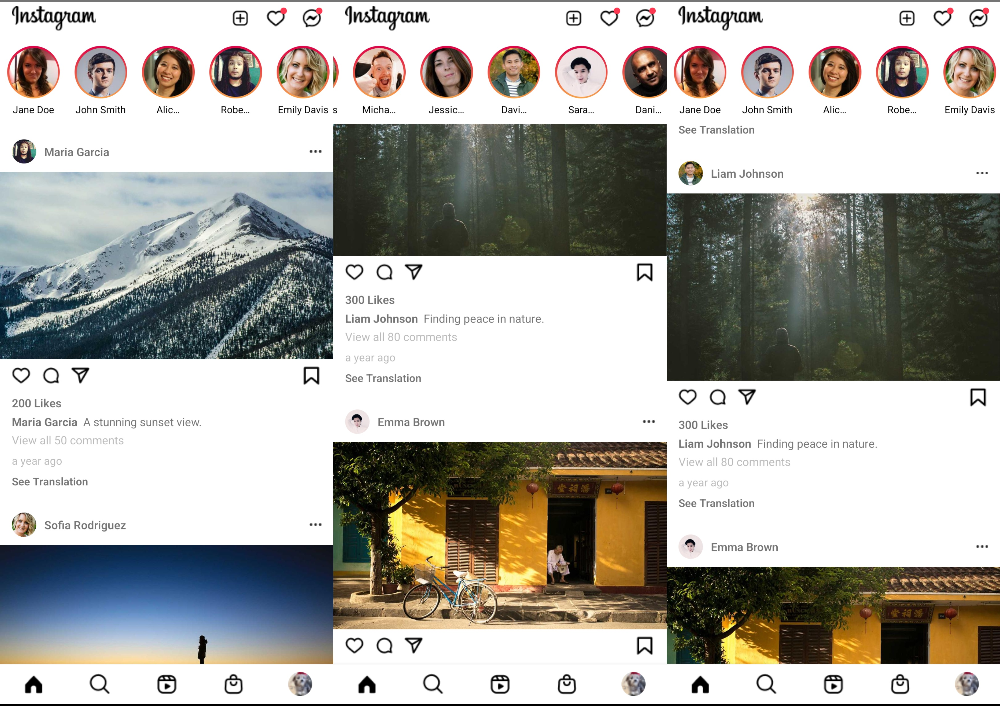
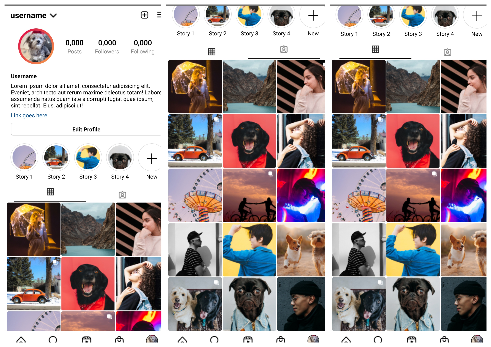

# Instagram-Clone in React Native

## Description

This is an Instagram clone built using React Native. The project aims to replicate the core features of Instagram, providing a similar user experience and UI.

## Libraries

- **react-navigation**: Handles navigation between screens.
- **react-native-screens**: Optimizes navigation performance by providing native primitives for navigation.
- **react-native-safe-area-context**: Ensures that content is rendered within safe areas, accounting for notches, status bars, etc.
- **react-native-linear-gradient**: Adds beautiful linear gradient backgrounds to various components.
- **react-native-read-more**: Provides a "Read More" feature for longer text, collapsing and expanding content dynamically.
- **dayjs**: A lightweight library for parsing, validating, manipulating, and formatting dates.

## Design

You can find the design for this app on Figma:

[Figma Design](<https://www.figma.com/design/R1nWjKlB6mdpDrvDa0lPXi/Instagram-UI-Kit-(Community)?node-id=279-583&t=Z3WL3SUPp4KK7qOK-0>)

## Preview

Take a look at some previews of the app:





## Installation

To run the project locally, follow these steps:

1. Clone the repository:

```bash
git clone https://github.com/KamilErdogmus/RN-Instagram-Clone.git
```

2. Navigate to the project directory:

```bash
cd your-repository
```

3. Install dependencies:

#### Using npm

```bash
npm install
```

#### Using yarn

```bash
yarn install
```

## Step 1: Start the Metro Server

First, you'll need to start **Metro**, the JavaScript _bundler_ that comes with React Native.

To start Metro, run the following command from the _root_ of your React Native project:

#### Using npm

```bash
npm start
```

#### Using Yarn

```bash
yarn start
```

## Step 2: Start your Application

Let Metro Bundler run in its _own_ terminal. Open a _new_ terminal from the _root_ of your React Native project. Run the following command to start your _Android_ or _iOS_ app:

### For Android

#### Using npm

```bash
npm run android
```

#### Using Yarn

```bash
yarn android
```

### For iOS

##### using npm

```bash
npm run ios
```

#### Using Yarn

```bash
yarn ios
```

If everything is set up _correctly_, you should see your new app running in your _Android Emulator_ or _iOS Simulator_ shortly provided you have set up your emulator/simulator correctly.

This is one way to run your app — you can also run it directly from within Android Studio and Xcode respectively.

## Step 3: Modifying your App

Now that you have successfully run the app, let's modify it.

1. Open `App.jsx` in your text editor of choice and edit some lines.
2. For **Android**: Press the <kbd>R</kbd> key twice or select **"Reload"** from the **Developer Menu** (<kbd>Ctrl</kbd> + <kbd>M</kbd> (on Window and Linux) or <kbd>Cmd ⌘</kbd> + <kbd>M</kbd> (on macOS)) to see your changes!

   For **iOS**: Hit <kbd>Cmd ⌘</kbd> + <kbd>R</kbd> in your iOS Simulator to reload the app and see your changes!

## Congratulations! :tada:

You've successfully run and modified your React Native App. :partying_face:

### Now what?

- If you want to add this new React Native code to an existing application, check out the [Integration guide](https://reactnative.dev/docs/integration-with-existing-apps).
- If you're curious to learn more about React Native, check out the [Introduction to React Native](https://reactnative.dev/docs/getting-started).

# Troubleshooting

If you can't get this to work, see the [Troubleshooting](https://reactnative.dev/docs/troubleshooting) page.

# Learn More

To learn more about React Native, take a look at the following resources:

- [React Native Website](https://reactnative.dev) - learn more about React Native.
- [Getting Started](https://reactnative.dev/docs/environment-setup) - an **overview** of React Native and how setup your environment.
- [Learn the Basics](https://reactnative.dev/docs/getting-started) - a **guided tour** of the React Native **basics**.
- [Blog](https://reactnative.dev/blog) - read the latest official React Native **Blog** posts.
- [`@facebook/react-native`](https://github.com/facebook/react-native) - the Open Source; GitHub **repository** for React Native.
